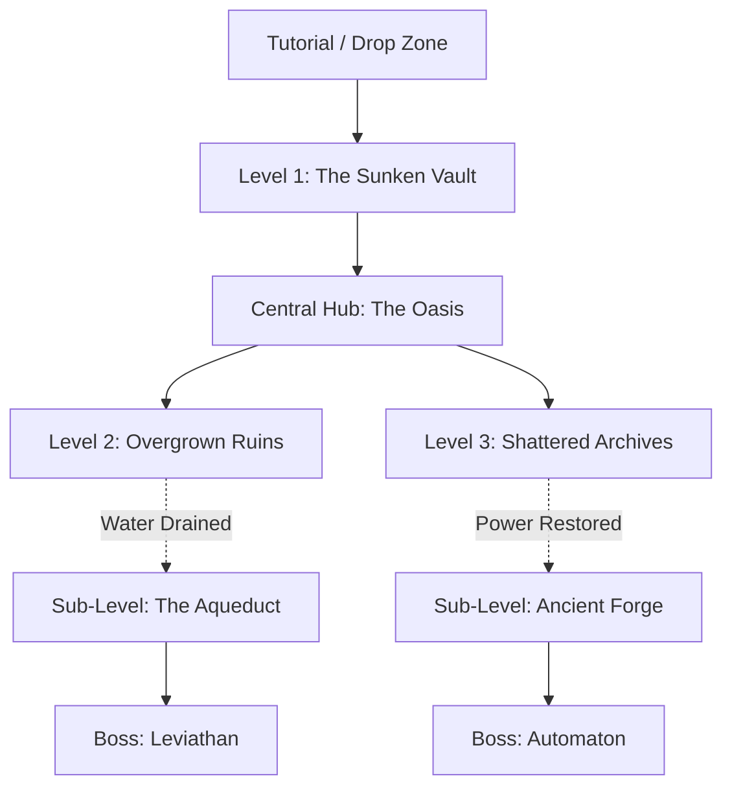
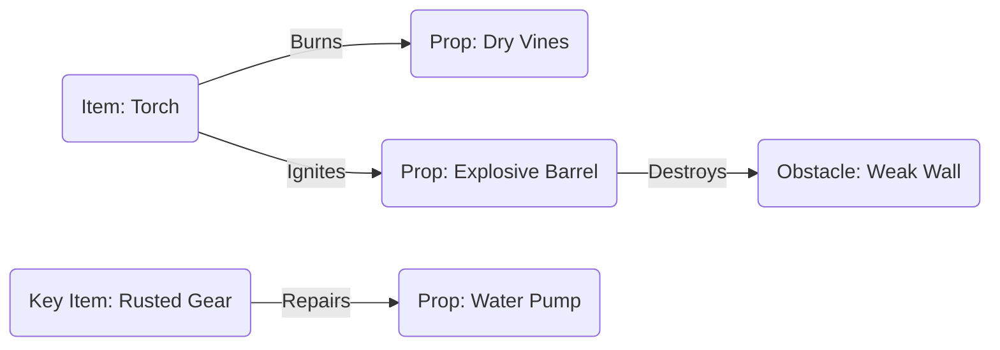

# Master Level Design & Architecture Document

This document serves as our single source of truth for level maps, puzzle logic, item interaction dependencies, and navigation flow. It allows us to expand levels over time while keeping everything interconnected.

---

## 1. World & Navigation Flow Architecture

### Global Progression Graph
*Visualizes how Level 1 -> Level 2 -> Hub -> Sub-levels flow.*



### Gating & Lock-and-Key Mechanics
*Standardized key for soft gates vs. hard gates.*

| Gate Type | Designation | Description | Example |
| :--- | :--- | :--- | :--- |
| **Soft Gate** | `[SG-Ability]` | Requires a specific movement or interaction ability to bypass, but player might sequence break. | Double Jump, Grapple Hook, Heavy Lifting |
| **Soft Gate** | `[SG-Item]` | Requires a consumable or specific item to unlock/reveal a path. | Explosive Barrel, Torch |
| **Hard Gate** | `[HG-Story]` | Path blocked until a specific narrative milestone or NPC dialogue is completed. | Guard refuses entry until you have the Royal Sigil |
| **Hard Gate** | `[HG-Boss]` | Arena locks or path is impassable until a specific boss or mini-boss is defeated. | Boss arena doors lock upon entry |
| **Hard Gate** | `[HG-Key]` | Requires a unique, non-consumable key item that is mandatory for progression. | Vault Keycard, Boss Room Key |

### Pacing & Tension Profile
*Framework to mark pacing beats for every level, ensuring a balanced emotional curve.*

| Pacing Beat | Description | Target Tension Level (1-10) |
| :--- | :--- | :--- |
| **[P-Explore]** | Low threat, focus on atmosphere, lore, and navigation. | 2-3 |
| **[P-Puzzle]** | Mental engagement, moderate tension, safe environment. | 4-5 |
| **[P-Combat]** | High threat, adrenaline spike, requires mechanical skill. | 7-8 |
| **[P-Climax]** | Boss fight or major set-piece, maximum tension. | 9-10 |
| **[P-Rest]** | Safe zone, save point, upgrading, reward collection. | 1 |

---

## 2. Level Design Master Template (Modular Structure)

*The following is the standard modular template applied to an example level.*

### `LEVEL_01_THE_SUNKEN_VAULT`

#### Level Metadata
- **Level ID:** `LVL-001`
- **Name:** The Sunken Vault
- **Target Duration:** 15-20 minutes
- **Pacing Tag:** `[P-Explore]` -> `[P-Puzzle]` -> `[P-Combat]` -> `[P-Climax]`
- **Core Theme:** Forgotten wealth swallowed by the tides; water, stone, and decay.
- **Primary Mechanic:** Water Level Manipulation (Drain/Fill).

#### Level Topology & Map Layout

**Map Layout (Critical Path vs. Optional)**
```mermaid
graph TD
    Entry[Entrance / Drop In] --> Z1[Zone 1: Flooded Antechamber]

    Z1 -->|Critical Path| Z2[Zone 2: Pump Control Room]
    Z1 -.->|Optional [SG-Item: Torch]| S1[Secret 1: Hidden Stash]

    Z2 -->|Drain Water| Z3[Zone 3: Lower Courtyard]
    Z3 -.->|Optional [SG-Ability: Grapple]| S2[Secret 2: High Balcony]

    Z3 --> Z4[Zone 4: Vault Doors]
    Z4 --> Boss[Boss Arena: Vault Guardian]
    Boss --> Exit[Exit to Hub]

    %% Shortcuts
    Z3 -->|Unlock Door (One-way)| Z1
```

**Room/Zone Breakdown Table**
| Zone ID | Name | Purpose | Sightlines / Framing | Chokepoints |
| :--- | :--- | :--- | :--- | :--- |
| **Z1** | Flooded Antechamber | Introduce water theme, establish barrier (sunken door). | Framing the massive locked vault door below the water surface. | N/A |
| **Z2** | Pump Control Room | Puzzle room (Water manipulation). | Control console overlooks Z1 through a glass window. | Narrow hallway leading in. |
| **Z3** | Lower Courtyard | Combat arena, previously flooded. | Wide open space, rubble provides cover. | Entry stairs are a bottleneck. |
| **Z4** | Vault Doors | Climax anticipation, final prep. | Dominant, imposing vault door with glowing locks. | Heavy blast doors seal behind player. |

#### Navigation & Flow
- **Entry/Exit Vectors:** Player drops in from a collapsed ceiling (one-way entry). Exit is an elevator up to the Hub.
- **Shortcuts:** A reinforced door in Z3 can be unbolted from the inside to lead back to Z1, creating a loop.
- **Breadcrumbs & Signposting:**
  - *Lighting:* Blue bioluminescent moss highlights critical ledges.
  - *Landmarks:* A giant, shattered statue in Z1 serves as a cardinal reference point.
  - *Audio Queues:* The rushing sound of the pump mechanism guides the player to Z2.

---

## 3. Puzzle & Mechanic Integration System

### Puzzle Matrix

| Puzzle ID | Location | Core Puzzle Concept | Required Item/Ability | Reward / Gate Cleared |
| :--- | :--- | :--- | :--- | :--- |
| `PZL-01-A` | Z2 (Pump Room) | Restore power to the water pump by aligning gears. | Heavy Lifting (Default) | Lowers water level in Z1, unlocking Z3. |
| `PZL-01-B` | Z4 (Vault Doors) | Reflect light beam into the dual lock receptacles. | Mirror Shield | Unlocks `[HG-Boss]` arena. |

### Kishōtenketsu Design Sequence (Example: Water Manipulation)
- **Ki (Introduction):** Player enters Z1 and sees the primary exit submerged underwater. They must swim to a side path (Z2).
- **Shō (Development):** In Z2, player learns to interact with a crank to lower a small pool's water level, revealing a key.
- **Ten (Twist/Complication):** The main pump in Z2 is broken. The player must find replacement gears and align them while fending off minor enemies.
- **Ketsu (Conclusion):** The player uses the repaired pump to completely drain Z1. In the subsequent boss fight (Z4), the boss dynamically floods and drains the arena, forcing the player to use their understanding of the water levels to survive.

---

## 4. Item & Environment Interaction Matrix

### Item Dependency Map


### Inventory/Key Item Lifecycle

| Item Name | Found In | Used In | State | Description |
| :--- | :--- | :--- | :--- | :--- |
| **Rusted Gear** | Z1 (Bottom of pool) | Z2 (Pump Console) | Consumed | Required to fix the water pump. |
| **Vault Keycard** | Boss Drop | Exit Elevator | Consumed | Unlocks the path to the Hub. |
| **Mirror Shield** | Z3 (Chest) | Z4, Future Levels | Persists | Used to reflect light beams and block attacks. |

### Systemic Interactions
- **Water & Electricity:** If the player uses a Lightning spell in flooded areas, it creates an AoE shock hazard that damages both enemies and the player.
- **Explosives & Structures:** Explosive Barrels can break cracked stone walls, but their blast radius is reduced significantly underwater.

---

## 5. Cross-Level Dependency & Expansion Roadmap

### Level Interconnection Matrix

| Triggering Action | Source Level | Affected Target Level | Result / Consequence |
| :--- | :--- | :--- | :--- |
| Drain the Water Pump | Level 1: Sunken Vault | Hub: The Oasis | A dry riverbed in the Hub fills with water, allowing a boat to be used. |
| Restore the Core | Level 3: Shattered Archives | Level 2: Overgrown Ruins | Automated defenses in the Ruins reactivate, changing enemy spawns. |

### Roadmap & Milestone Tracker

*Status Tags:* `[Draft]`, `[Greybox]`, `[Blockout]`, `[Playtested]`, `[Final]`

| Level ID | Level Name | Status | Assigned To | Notes |
| :--- | :--- | :--- | :--- | :--- |
| `LVL-000` | Tutorial | `[Final]` | @LevelDesignTeam | Needs minor lighting tweaks. |
| `LVL-001` | The Sunken Vault | `[Playtested]` | @LevelDesignTeam | Adjust pacing in Z3 combat encounter. |
| `LVL-002` | Overgrown Ruins | `[Blockout]` | @LevelDesignTeam | Geometry done, waiting on art assets. |
| `LVL-003` | Shattered Archives| `[Draft]` | @LevelDesignTeam | Finalizing puzzle concepts. |
