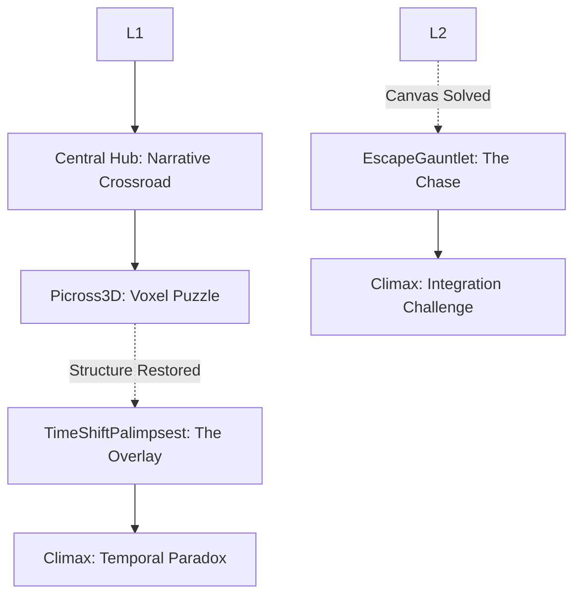

# Master Level Design & Architecture Document

This document serves as our single source of truth for level maps, puzzle logic, gameplay archetypes (GameModes), and navigation flow. It details the hybrid mechanics that drive progression.

---

## 1. World & Navigation Flow Architecture

### Global Progression Graph
*Visualizes how the distinct GameModes connect and flow into one another.*

### RPG Stats as Cross-Mechanic Modifiers
*How the core RPG stats defined in GameManager.gd interact with different game modes.*

| Stat Name | Relevant Mode(s) | Effect / Modifier |
| :--- | :--- | :--- |
| **Health & Endurance** | `Picross3D` | If `health < 50` or `endurance < 50`, the 3D voxel states become corrupted (turning red), increasing puzzle difficulty. |
| **Alchemy Discipline** | `Picross3D` | If `alchemy_discipline > 1`, the player can apply custom colors/materials to voxels, solving advanced puzzle constraints. |

---

## 2. Gameplay Archetypes (GameModes)

### Mode Overview
The application currently integrates multiple distinct structural archetypes, driven by `GameManager.gd`:

3. **`Picross3D` (3D Voxel Puzzles)**: Driven by `VoxelGrid3D.gd`. Players chisel away incorrect voxels and use Alchemy to color them. Solving this passes templates to the 2D canvas.
4. **`DetectiveCrimeScene`**: Non-linear 3D/2D exploration for uncovering clues.
5. **`EscapeGauntlet`**: Time-pressured Voxel puzzles under extreme tension.
6. **`TimeShiftPalimpsest`**: 2D past/present overlays requiring temporal deduction.

---

## 3. Core Gameplay Loops & Integration

### The Cross-Mechanic Puzzle Matrix

| Interaction | Source Mode | Target Mode | Required Stat/Condition | Result / Reward |
| :--- | :--- | :--- | :--- | :--- |
| **Survive Corruption** | `EscapeGauntlet` | `Picross3D` | `health > 50`, `endurance > 50` | Maintaining high health/endurance prevents voxels from corrupting during time-pressured chiseling sequences. |

### Kishōtenketsu Design Sequence (Example: 3D to 2D Pipeline)
- **Shō (Development):** The game shifts to `Picross3D`. The player chisels a 3D voxel block based on clues.
- **Ten (Twist/Complication):** The player's health drops, corrupting the voxels. They must use their `Alchemy` stat to recolor specific blocks to stabilize the structure.

---

## 4. Expansion Roadmap & Status

*Tracking the implementation of the structural archetypes.*

| GameMode ID | Description | Status | Core Script Dependency |
| :--- | :--- | :--- | :--- |
| `Picross3D` | 3D chiseling and coloring | `[Playtested]` | `VoxelGrid3D.gd` |
| `DetectiveCrimeScene`| Non-linear exploration | `[Draft]` | TBD |
| `EscapeGauntlet` | Timed pressure sequences | `[Blockout]` | TBD |
| `TimeShiftPalimpsest`| Temporal 2D overlay puzzles | `[Draft]` | TBD |
